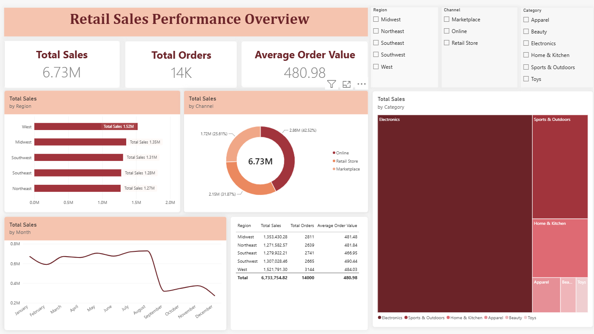

# Retail Sales Dashboard (Power BI)

An interactive dashboard analyzing retail sales performance across region, category, and channel.

## Features
- KPI cards: Total Sales, Total Orders, Average Order Value
- Sales breakdown by Region, Category, and Channel
- Monthly sales trend
- Interactive filters (slicers)

## Preview

## File
Download the full Power BI file: [retail-sales-dashboard.pbix](retail-sales-dashboard.pbix)
